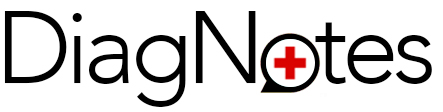

# Target Audience: 
Doctors, Clinicians, Nursing, Medstaff, Dental, Massage, Chiropractic, etc

Problem to address: medstaff spend 15-20 hours of overtime every week recording notes for insurance purposes. The medical industry is highly overburdened with patients and this steals from their time caring for patients. This will make their practice more efficient and better.

Primary goal of the product: make it easier for doctors to record patient interactions and report to insurance. The patients get more attention.
Provide a calendar that generates an html for each appointment, set up with patient name and date, then they press recording button to start capturing notes.

UserStories:

calendar page
As a medical professional, I want to look at my daily calendar to see my appointments to get prepared for each. I can click on appointment block to access recorder.

log in page
as a medical staff person, I want to provide my credentials to make sure I log in to my personal calendar so that I can find my appointments for the day.

'doc page'
As a user I want to record the conversation and put it into text(Transcribe it). So that I'm able to retreive it as needed in any given time and for any purpose. The notes will keep the doc updated on the patient cases and they will be able to to track all of their patient history, medication and last consolutation notes. 

secondary goals/features:
translation
audio recording
