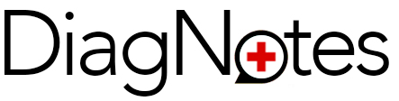

# Target Audience: 
Doctors, Clinicians, Nursing, Medstaff, Dental, Massage, Chiropractic, etc.

## Problems to Solve: 
### Overburdened medical staff leads to neglect
According to the [Washington Post](https://www.washingtonpost.com/news/to-your-health/wp/2014/05/22/how-many-patients-should-your-doctor-see-each-day/?noredirect=on&utm_term=.963444d6a07c) the average Primary Care Physician has "about 2,300 patients under his or her care." I have observed how this volume affects doctors while interning under several physical therapists. We would often visit 25+ patients per day in a geriatric setting. Nurses were on the same schedule. While I do believe that all of these staff went into the field with dreams of helping people, the sad reality is overburden and neglect. I saw cleaning supplies left out in rooms where the residents suffered from dementia, medications knocked over by nurses and left on the floor, and frankly disgusting living quarters (despite residents paying upwards of $5,000/month to live in the facility).

### Insurance reimbursement requirements equates to excessive note-taking
According to the [AMA](https://www.ama-assn.org/practice-management/digital/family-doctors-spend-86-minutes-pajama-time-ehrs-nightly), primary care physicians spend "more than half of their work day interacting with the EHR (electronic health record)...That consisted of 1.4 hours after work." This kills chances to build rapport and make a genuine connection with clients, which leads to worse outcomes for the patient. In my experience, the phenomenon holds true for physical therapists and nurses as well. The overtime every week recording notes for insurance reporting purposes is exhausting and inefficient.  

## How we can help 
1. Provide a speech recognition that will capture doctors conversations so that they do not have to scribble notes while talking to patients.
2. House these notes in local storage for protection and easy access.
3. Include useful APIs to brighten the doctors day on the way to each appointment (jokes they can share with the patient, or at least get a chuckle out of them), medical information (medication dosages, adverse reactions, etc.), local pharmacies (price comparisons, and distance). 
4. Organize the notes by appointment and make scheduling easy with a simple calendar. 

## Future Features?
1. Translation.
2. Fully integrated google calendar API so that receptionists can schedule doctor's appointments and have all of our content attached.
3. Text parsing for easy transcription to medical forms.
